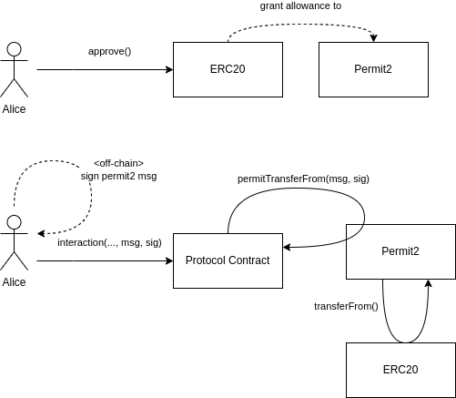

# Introduction

Permit2 introduces a low-overhead, next generation token approval/meta-tx system to make token approvals easier, more secure, and more consistent across applications.

# Features

- **Signature Based Approvals**: Any ERC20 token, even those that do not support [EIP-2612](https://eips.ethereum.org/EIPS/eip-2612), can now use permit style approvals. This allows applications to have a single transaction flow by sending a permit signature along with the transaction data when using Permit2 integrated contracts.
- **Batched Token Approvals**: Set permissions on different tokens to different spenders with one signature.
- **Signature Based Token Transfers**: Owners can sign messages to transfer tokens directly to signed spenders, bypassing setting any allowance. This means that approvals aren't necessary for applications to receive tokens and that there will never be hanging approvals when using this method. The signature is valid only for the duration of the transaction in which it is spent.
- **Batched Token Transfers**: Transfer different tokens to different recipients with one signature.
- **Safe Arbitrary Data Verification**: Verify any extra data by passing through a witness hash and witness type. The type string must follow the [EIP-712](https://eips.ethereum.org/EIPS/eip-712) standard.
- **Signature Verification for Contracts**: All signature verification supports [EIP-1271](https://eips.ethereum.org/EIPS/eip-1271) so contracts can approve tokens and transfer tokens through signatures.
- **Non-monotonic Replay Protection**: Signature based transfers use unordered, non-monotonic nonces so that signed permits do not need to be transacted in any particular order.
- **Expiring Approvals**: Approvals can be time-bound, removing security concerns around hanging approvals on a wallet’s entire token balance. This also means that revoking approvals do not necessarily have to be a new transaction since an approval that expiries will no longer be valid.
- **Batch Revoke Allowances**: Remove allowances on any number of tokens and spenders in one transaction.

# Flow

1. Alice calls approve() on an ERC20 to grant an infinite allowance to the canonical Permit2 contract.
2. Alice signs an off-chain "permit2" message that signals that the protocol contract is allowed to transfer tokens on her behalf.
3. Alice calls an interaction function on the protocol contract, passing in the signed permit2 message as a parameter.
4. The protocol contract calls permitTransferFrom() on the Permit2 contract, which in turn uses its allowance (granted in 1.) to call transferFrom() on the ERC20 contract, moving the tokens held by Alice.

It might seem like a regression to require the user to grant an explicit allowance first. But rather than granting it to the protocol directly, the user will instead grant it to the canonical Permit2 contract. This means that if the user has already done this before, say to interact with another protocol that integrated Permit2, every other protocol can skip that step.

Instead of directly calling transferFrom() on the ERC20 token to perform a transfer, a protocol will call permitTransferFrom() on the canonical Permit2 contract. Permit2 sits between the protocol and the ERC20 token, tracking and validating permit2 messages, then ultimately using its allowance to perform the transferFrom() call directly on the ERC20. This indirection is what allows Permit2 to extend EIP-2612-like benefits to every existing ERC20 token.

Also, like EIP-2612 permit messages, permit2 messages expire to limit the the attack window of an exploit.